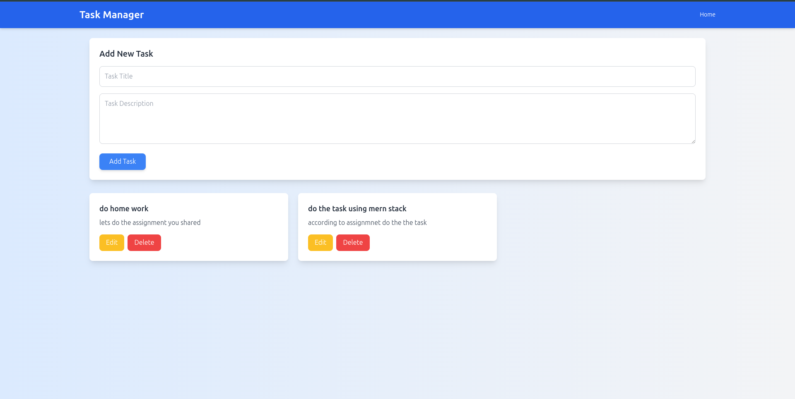
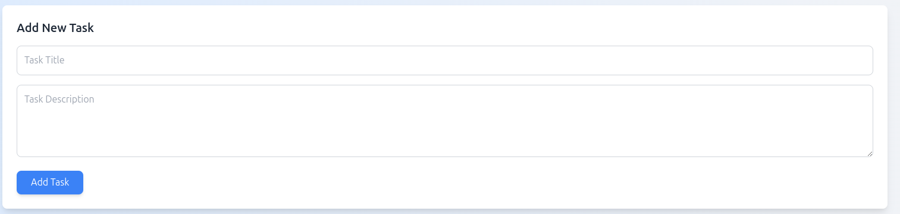
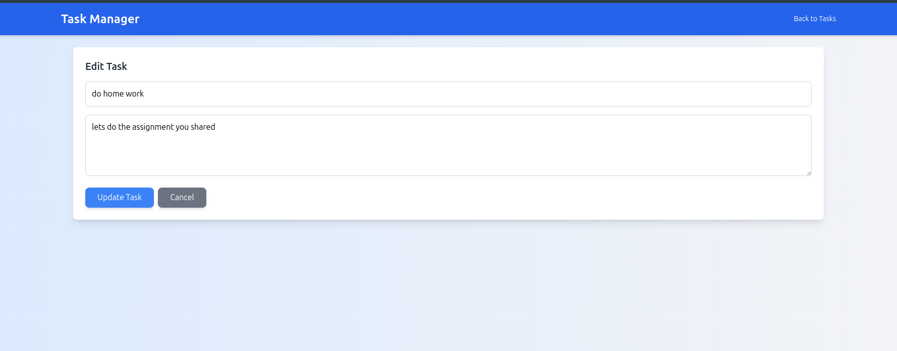

# Task Manager

A server-rendered Task Manager application built with Express, MongoDB, and EJS. Manage tasks with a modern, responsive UI styled using Tailwind CSS.

## Features
- **Create Tasks**: Add tasks with a title (minimum 3 characters) and description.
- **View Tasks**: Display all tasks in a responsive grid with clean card designs.
- **Edit Tasks**: Update task details via a dedicated edit form.
- **Delete Tasks**: Remove tasks with a single click.
- **Validation**: Server-side checks for valid input, with styled error messages.
- **Modern UI**: Gradient background, hover effects, and a cohesive blue theme.
- **Responsive Design**: Works seamlessly on desktop and mobile devices.

## Screenshots

### Task List
View all tasks in a responsive grid with edit and delete options.



### Add Task
Add a new task with a styled form and clear validation feedback.



### Edit Task
Edit existing tasks with a consistent, user-friendly form.



## File Structure
```
task-manager/
├── server/
│   ├── models/
│   │   └── Task.js          # Mongoose schema
│   ├── routes/
│   │   └── tasks.js        # Routes for EJS rendering and API
│   ├── views/
│   │   ├── index.ejs       # Main task list template
│   │   └── edit.ejs        # Edit task template
│   ├── public/
│   │   └── assets/
│   │       ├── task-list.png  # Screenshot of task list
│   │       ├── add-task.png   # Screenshot of add task form
│   │       └── edit-task.png  # Screenshot of edit task form
│   ├── server.js           # Main server file
│   ├── package.json        # Dependencies
│   └── .env                # Environment variables
└── README.md               # Project documentation
```

## Setup Instructions

### Prerequisites
- Node.js (>=14.x)
- MongoDB (MongoDB Atlas or local)
- npm

### Server Setup
1. Navigate to the `server/` directory:
   ```bash
   cd server
   ```
2. Install dependencies:
   ```bash
   npm install
   ```
3. Create a `.env` file in `server/` with:
   ```
   MONGO_URI=mongodb+srv://<username>:<password>@postmitra.dddcf.mongodb.net/task-manager?retryWrites=true&w=majority
   ```
   Replace `<username>` and `<password>` with your MongoDB Atlas credentials, or use `mongodb://localhost/task-manager` for a local MongoDB instance.
4. Add screenshots to `server/public/assets/`:
   - Capture screenshots of the app:
     - Task list: Main page at `http://localhost:5000`.
     - Add task: Form on the main page.
     - Edit task: Edit form at `http://localhost:5000/tasks/edit/<task-id>`.
   - Save as `task-list.png`, `add-task.png`, and `edit-task.png` in `server/public/assets/`.
5. Start the server:
   ```bash
   npm start
   ```
   The server runs on `http://localhost:5000`.

### Accessing the App
- Open `http://localhost:5000` in your browser.
- View screenshots at:
  - `http://localhost:5000/assets/task-list.png`
  - `http://localhost:5000/assets/add-task.png`
  - `http://localhost:5000/assets/edit-task.png`

### Notes
- The frontend is rendered server-side using EJS templates.
- API endpoints (`/api/tasks`) are available but not used by the EJS frontend.
- Tailwind CSS is included via CDN for styling.
- Screenshots must be added manually to `server/public/assets/`.
- For production, secure the MongoDB URI and configure CORS.

## Troubleshooting
- **MongoDB Connection Error**: Verify `MONGO_URI` in `.env` and MongoDB Atlas IP whitelist (add `0.0.0.0/0` for testing).
- **Screenshots Not Loading**: Ensure images are in `server/public/assets/` and accessible via `http://localhost:5000/assets/<image>.png`.
- **404 Errors**: Confirm all EJS templates are in `server/views/` and `server.js` serves static files from `public/`.
- **CORS Issues**: The `cors` middleware is enabled for API routes.
- **UI Issues**: Check the Tailwind CSS CDN URL and browser console for errors.

For further assistance, contact the developer or raise an issue.